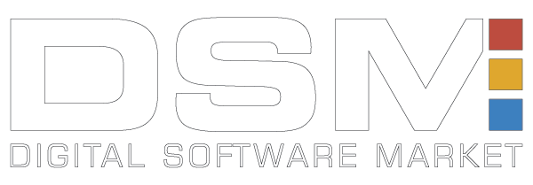
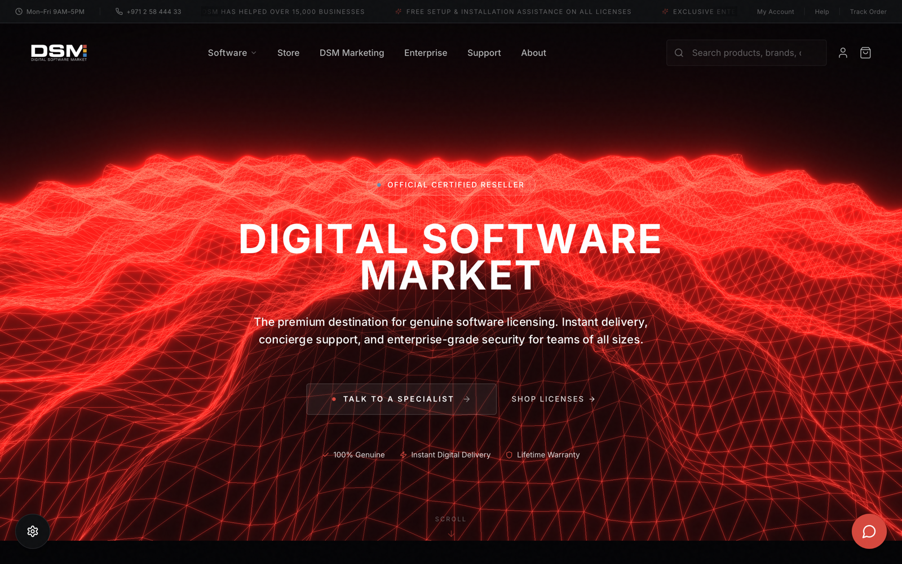
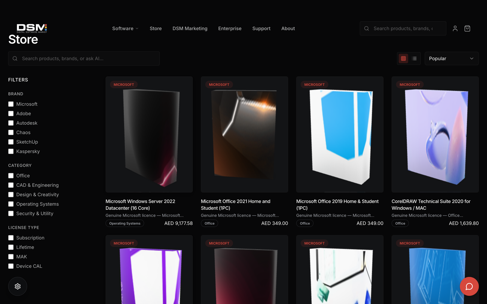
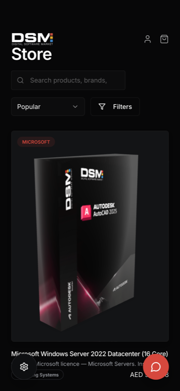

<div align="center">



# DSM — Digital Software Market

### The luxury concierge for genuine software licences.

Microsoft, Adobe, Autodesk & friends — browsed in 3D, sorted by an AI concierge,
and delivered instantly. No dodgy keys, no buyer's remorse, just licences done right.

<br/>



</div>

---

## What is this thing?

**DSM** is a premium storefront for legitimate software licensing. Think of it as the
boutique of software keys — every product sits on the shelf as a spinnable **3D box**,
an **AI concierge** helps you find the right SKU by chatting, and the whole thing is
wrapped in a moody, crimson-on-charcoal design that takes itself just seriously enough.

It's a single-page app (React + Vite + TypeScript) with a storefront, product modals,
a cart, a checkout flow, and a marketing surface — plus a built-in offline catalogue so
it runs beautifully even when there's no backend in sight.

> **Fun fact:** every product card renders a real `.glb` model with `@google/model-viewer`,
> so the "boxes" actually catch the light as you scroll. It's shelf appeal, literally.

## Feature reel

- **Store 347 licences deep** — Microsoft, Adobe, Autodesk, Chaos, SketchUp, Kaspersky and more.
- **3D product boxes** — every card is a lazily-loaded, self-rotating GL model (381 bundled).
- **AI concierge** — a floating chat that understands "I need Office for 3 machines" and
  navigates the store for you (falls back to a local matcher when offline).
- **Smart filters & sort** — by brand, category, licence type, price and popularity.
- **Cart → checkout flow** — the whole shopping journey, client-side and snappy.
- **Marketing mode toggle** — flip the site between the full storefront and a bare AI kiosk.
- **Offline-first catalogue** — no backend? No problem. DSM serves a bundled catalogue so
  the grid is never empty (great for demos and static hosting).
- **Fully responsive** — from a 27" monitor down to a phone in your pocket.

## Gallery

| Storefront | Mobile |
| :---: | :---: |
|  |  |

## Quick start (yes, even if you've never touched React)

You'll need **Node.js 18+** and **npm**. Don't have them? Grab Node with
[nvm](https://github.com/nvm-sh/nvm#installing-and-updating) — it's the friendliest way.

```sh
# 1. Clone the shop
git clone https://github.com/waleedsworld/dsm-agentic.git
cd dsm-agentic

# 2. Install the goods
npm install

# 3. Open the doors (hot-reload dev server)
npm run dev
```

Now visit **http://localhost:8080** and you're in. 🎉

That's the whole ritual. On first load with no backend running, DSM quietly falls back to
its bundled catalogue, so you'll see real products and 3D boxes straight away.

### Build for production

```sh
npm run build      # bundles into dist/
npm run preview    # serve the production build locally to sanity-check it
```

### The rest of the toolbox

| Command | What it does |
| --- | --- |
| `npm run dev` | Dev server with hot module reload (port 8080) |
| `npm run build` | Production build into `dist/` |
| `npm run preview` | Preview the production build |
| `npm run lint` | Run ESLint over the project |
| `npm run test` | Run the Vitest suite |
| `npm run test:watch` | Run tests in watch mode |

## Connecting a live backend (optional)

Out of the box DSM runs on its offline catalogue. To wire it to a real DSM API for live
inventory, pricing, and the full AI concierge, point it at your backend:

```sh
# .env
VITE_API_BASE=https://your-dsm-backend.example.com
```

If the backend is unreachable at runtime, DSM automatically degrades to the bundled
catalogue and logs a friendly note in the console — the storefront never goes dark.

## Under the hood

| Layer | Tech |
| --- | --- |
| Build tool | **Vite 5** (`@vitejs/plugin-react-swc`) |
| UI | **React 18** + **TypeScript** |
| Styling | **Tailwind CSS** + **shadcn/ui** (Radix primitives) |
| 3D | **three.js** + **@google/model-viewer** |
| Data/state | **React Query**, a lightweight `AppContext` |
| Routing | **react-router-dom** |
| Tests | **Vitest** + **Testing Library** |

Project shape:

```
src/
├── components/     # Header, Hero, ProductCard, GlobalAIChat, ModelViewer…
├── contexts/       # AppContext — cart, filters, marketing mode, theme
├── data/           # bundled catalogue + 3D model index
├── lib/
│   ├── api.ts             # backend client with automatic offline fallback
│   └── staticCatalogue.ts # normalises the bundled catalogue into full products
├── pages/          # Index, Storefront, Cart, Checkout, Marketing, NotFound
└── test/           # Vitest suites
public/
└── models/         # 381 .glb product models
```

## Live demo

**Live demo — deploying soon.** ✨ (Grab the repo and `npm run dev` in the meantime — it's
the same experience, minus the URL to brag about.)

## License

Product names, logos and trademarks (Microsoft, Adobe, Autodesk, and others) belong to
their respective owners; DSM is a reseller storefront and is not affiliated with or
endorsed by those vendors. The application code in this repository is the author's own work.

<div align="center">
<br/>
Made with a lot of crimson and a little caffeine. ☕
</div>
